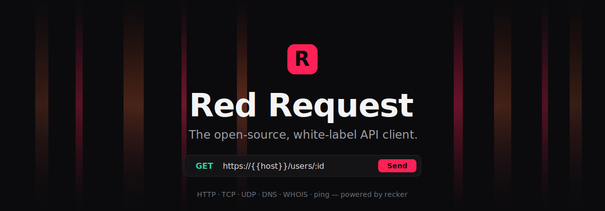
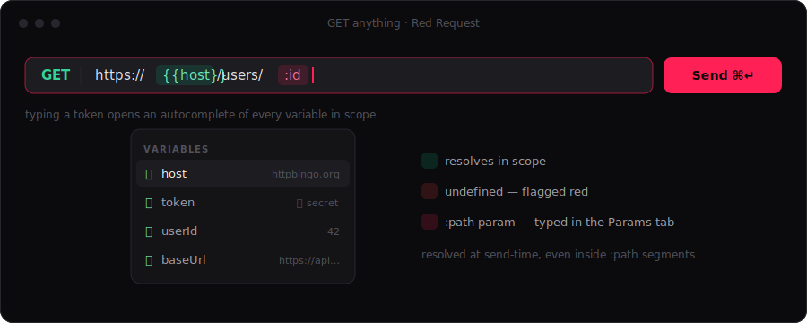
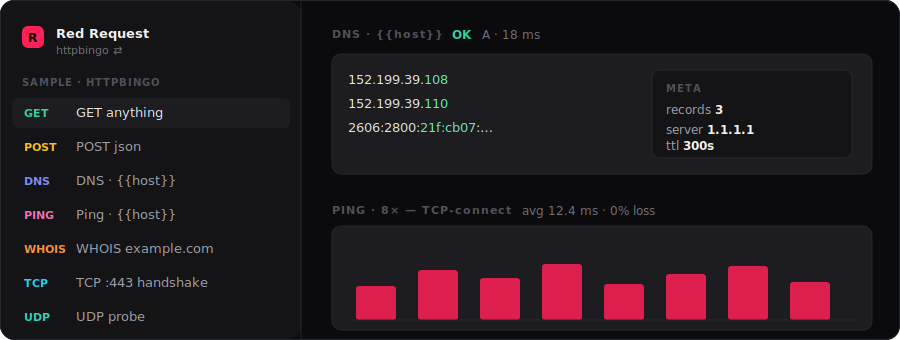

<div align="center">



<p>
  <a href="https://github.com/reddb-io/red-request/releases"></a>
  <a href="https://github.com/reddb-io/red-request/actions/workflows/ci.yml"></a>
  <a href="LICENSE"></a>
  
</p>

<strong>The API client that respects you</strong> — native, offline-first, git-friendly, and entirely yours to rebrand.<br>
Built on the <a href="https://github.com/forattini-dev/recker"><code>recker</code></a> multi-protocol SDK and shipped as a <a href="https://tauri.app">Tauri&nbsp;2</a> desktop app. No Electron. No account. No telemetry.

</div>

---

## Install

```bash
# Linux — one line. Re-run any time to auto-upgrade.
curl -fsSL https://raw.githubusercontent.com/reddb-io/red-request/main/install.sh | bash
```

On Linux this installs the **`.deb`** (verifying its `sha256` against the release
`checksums.txt` first) — it links the system's WebKitGTK/glibc so the app and its bundled
sidecars start reliably. Needs apt/sudo; re-run any time to upgrade. Prefer the portable
single-file build? Add `--appimage` to drop a no-sudo AppImage on your PATH at `~/.local/bin`
(note: an AppImage built on an older glibc can be unstable on newer hosts).

When a newer release exists the script upgrades automatically. If you're **already on the
latest tag** it no-ops (`… is already the latest — nothing to do`). To reinstall the same
version anyway — e.g. to re-pull the bundled RedDB sidecar after a rebuild, or to repair a
broken install — add `--force`. Pin a specific release with `--version vX.Y.Z`:

```bash
# reinstall the current version (refreshes the bundled sidecar / repairs the install)
curl -fsSL https://raw.githubusercontent.com/reddb-io/red-request/main/install.sh | bash -s -- --force

# install/downgrade to a specific release
curl -fsSL https://raw.githubusercontent.com/reddb-io/red-request/main/install.sh | bash -s -- --version v0.25.2
```

> The app always runs its **own bundled** RedDB sidecar (next to the executable), not a
> `red` you may have on your `PATH` — so `red --version` in a terminal can differ from the
> sidecar the app actually uses. After upgrading, the bundled sidecar is whatever that
> release pinned.

To remove either:

```bash
curl -fsSL https://raw.githubusercontent.com/reddb-io/red-request/main/uninstall.sh | bash
```

Prefer a click, or apt? Grab your platform from the **[latest release](https://github.com/reddb-io/red-request/releases/latest)**:

| Linux                  | macOS                  | Windows                    |
| ---------------------- | ---------------------- | -------------------------- |
| `.AppImage` · `.deb`   | `.dmg` (Apple Silicon) | `.msi` · NSIS `-setup.exe` |

<sub>Builds are unsigned for now — macOS: right-click → **Open** · Windows: **More info → Run anyway**.</sub>

---

## What makes it nice

**Variables that light up.** Type `{{token}}` anywhere — URL, path params, query, headers,
body — and it renders highlighted: **green** when the variable resolves in scope, **red** when
it doesn't. Open a `{{` and an autocomplete of every known variable drops in. Path segments
like `/users/:id` are detected automatically and take a literal _or_ a `{{var}}` from your
environment.

<div align="center"></div>

**A real editor, not a textarea.** The request body and the response come with a line-number
gutter, a current-line highlight, one-click **Prettify** for JSON, and **Copy** on the
response. Pick a body type and the matching `Content-Type` and `Accept` headers are written
for you.

<div align="center"></div>

**Beyond HTTP.** Every request is dispatched through **recker**, so alongside HTTP you get
**TCP, UDP, ping, WHOIS and DNS** as first-class request kinds — with the same variables,
history and latency dashboard. WebSocket / GraphQL / SSE / gRPC are next.

<div align="center"></div>

**Move at the speed of thought.** A `⌘K` command palette jumps to any request or action. A
runner replays a request as a **repeat**, a **data-driven** sweep, or a **flow** that threads
`setVar` between steps. Query, header and form rows **drag to reorder**.

**Your data, your disk.** Everything lives in a local **RedDB** store — no cloud, no sign-in.
Export to a clean **YAML** tree (one request per file) to diff and review in PRs; secrets never
leave. Those secrets are sealed with **AES-256-GCM**, the master key kept in your **OS
keychain**.

**Truly white-label.** Product name, icon, accent colour and deep-link scheme all come from a
single `brand.config.json`. Ship it as _your_ product without forking a line of logic.

---

## How it compares

|                            | **Red Request** | Bruno | Insomnia | Postman |
| -------------------------- | :-------------: | :---: | :------: | :-----: |
| Open source                |      MIT ✓      |   ✓   | partial  |    —    |
| Fully offline              |        ✓        |   ✓   | partial  |    —    |
| No account required        |        ✓        |   ✓   |    —     |    —    |
| Git-friendly files         |     YAML ✓      |   ✓   | partial  |    —    |
| Native (no Electron)       |     Tauri ✓     |   —   |    —     |    —    |
| Beyond HTTP (TCP/UDP/DNS…) |        ✓        |   ~   |    ~     |    ~    |
| White-label / rebrandable  |        ✓        |   —   |    —     |    —    |

---

## Make it yours — white-label

Everything that says "Red Request" comes from one file. Say you're at **Google** and want a
blue build named **Google API** to hand to your team:

```jsonc
// brand/brand.config.json
{
  "productName": "Google API",
  "binaryName": "google-api",
  "identifier": "com.google.api",
  "accentColor": "#4285F4", // everything actionable turns blue
  "monogram": "G", // the badge in the sidebar/launcher
  "iconPath": "brand/assets/google-1024.png", // square PNG → app/installer icon
  "deepLinkScheme": "googleapi",
  "bgTokens": {
    "bg-0": "#0b0b0d",
    "bg-1": "#141417",
    "bg-2": "#1c1c21",
    "bg-3": "#26262d",
  },
}
```

```bash
pnpm install
pnpm brand:sync     # stamps name, identifier, green theme, deep-link, monogram
pnpm brand:icons    # regenerates icon.ico/.icns/PNGs from iconPath (tauri icon)
pnpm desktop:build  # → a branded installer for YOUR OS
```

`brand:sync` rewrites the Tauri config, the UI theme tokens (`--color-brand` = your accent,
so buttons, focus rings and highlights all go green) and the runtime brand constants.
Nothing in `src/` is touched — pure config.

**One binary for every platform.** Tauri can't cross-compile macOS/Windows/Linux from a
single machine — each OS builds its own. The clean way to ship to everyone:

1. **Fork** this repo and commit your `brand.config.json` + logo/icon.
2. Push a tag (`pnpm changeset` → merge the Version PR, or just `git tag v1.0.0 && git push --tags`).
3. The bundled [`release.yml`](.github/workflows/release.yml) runs `brand:sync` + `brand:icons`
   and builds **branded `.dmg` / `.msi` / `.deb`** for all platforms on its runners — they
   land on **your fork's** GitHub Release, ready to hand out.

No fork? Run `pnpm desktop:build` on a macOS, a Windows and a Linux box and collect the three
installers from `apps/desktop/src-tauri/target/release/bundle/`.

---

## Architecture

```
 Webview  ── SvelteKit (static) · Svelte 5 · shadcn-svelte
    │  @tauri-apps/api (invoke + events)
 Tauri / Rust  ── fs · OS keychain (secrets) · theming · deep links
    ├─ NDJSON-RPC (stdio) ─▶  engine sidecar  ──▶  recker  ──▶  HTTP · TCP · UDP · DNS · WHOIS · ping
    └─ HTTP 127.0.0.1     ─▶  RedDB `red`      ──▶  embedded .rdb store
```

recker is TypeScript over raw sockets, so it can't live in the webview — it runs as a
**sidecar** the Rust shell spawns and talks to over stdio. RedDB is a second sidecar serving
the local store. Decisions live in [`.red/adr/`](.red/adr); the glossary in
[`.red/CONTEXT.md`](.red/CONTEXT.md).

| Package                | Role                                                          |
| ---------------------- | ------------------------------------------------------------- |
| `@red-request/core`    | Shared Zod schemas + variable resolver (UI ⇄ engine contract) |
| `@red-request/engine`  | Bun/Node sidecar wrapping recker; NDJSON-RPC over stdio       |
| `@red-request/ui`      | SvelteKit (static) app — the client UI                        |
| `@red-request/desktop` | Tauri 2 shell (Rust)                                          |

---

## Develop

```bash
pnpm install
pnpm reddb:fetch     # download the RedDB sidecar (or pnpm reddb:sync to build from ../reddb)
pnpm desktop:dev     # launch the app with hot reload  ·  (pnpm dev = browser UI shell)
```

<details>
<summary><b>Projects — point the app at a folder (<code>rr .</code>)</b></summary>

A folder becomes a project when you open the app pointed at it — its data lives in
`<folder>/.red/request/app.rdb`, which you can commit. No folder ⇒ the global
`~/.red/request/app.rdb`.

```bash
pnpm desktop:build
ln -s "$PWD/scripts/rr" ~/.local/bin/rr
rr .                  # open the project rooted here
rr ~/work/my-api      # …or another folder
rr                    # global store
```

</details>

<details>
<summary><b>Run collections in CI (<code>rr-run</code>)</b></summary>

Export your collections to YAML (sidebar → **Export YAML**), commit them, and run them
headlessly — the same engine and `rr.test` assertions as the app, exit-coded for CI:

```bash
pnpm rr:run .red/request/_exports --env staging      # exits non-zero if any test fails
# flags: --env <name>  --grep <substr>  --bail
```

```yaml
# .github/workflows/api-tests.yml
- run: pnpm rr:run .red/request/_exports --env ci
```

Collections live in git; this runs them — diff/PR-review your API changes, gate merges on them.

</details>

<details>
<summary><b>Releasing (Changesets → tag → bundles)</b></summary>

`pnpm changeset` to describe a change. Merging the auto-opened **“Version Packages”** PR tags
`v*` and dispatches [`release.yml`](.github/workflows/release.yml) (no PAT needed), which builds
Linux/macOS/Windows bundles on Blacksmith runners and attaches them to the GitHub Release. The
RedDB sidecar is pulled from [reddb's releases](https://github.com/reddb-io/reddb/releases) at
build time (built from source on macOS until reddb ships darwin binaries).

</details>

---

## Roadmap

Shipped: HTTP · environments · variables · scripts & tests · six auth methods · keychain
secrets · TCP/UDP/ping/WHOIS/DNS · `⌘K` palette · runner · drag-reorder · code editor.
Next: WebSocket / GraphQL / SSE / gRPC · importers (Postman / Insomnia / OpenAPI / `.bru` /
curl / HAR) · code generation · a richer CI runner — see [`.red/CONTEXT.md`](.red/CONTEXT.md).

---

<div align="center">
<sub>Built by <a href="https://reddb.io">RedDB.io</a> · MIT · powered by <a href="https://github.com/forattini-dev/recker">recker</a> &amp; <a href="https://github.com/reddb-io/reddb">RedDB</a></sub>
</div>
